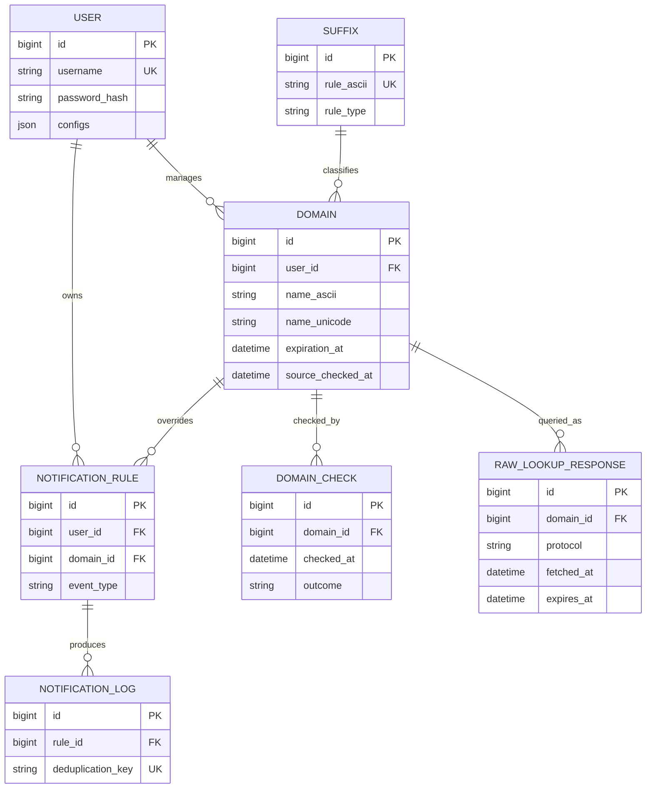

# 数据库设计

> 实施状态更新（2026-08-09）：持久化层以 PostgreSQL 15+ 为生产目标，SQLite
> 用于本地测试。查询缓存采用 `lookup_record` 不可变历史与
> `lookup_cache_head` 当前指针分离的模型；数据库实现位于
> `domainsmanager_persistence`，查询核心仅依赖公开 `LookupStore` SPI。
>
> 首版原始 WHOIS/RDAP payload 使用版本化 JSON + gzip，不做应用层加密；生产启用前
> 必须配置最小权限、备份加密和日志脱敏。模型已预留 encryption metadata，后续可在
> Store 层加入 AEAD decorator，而不改变查询或业务 API。

## 1. 目标与范围

DomainsManager 使用 SQLAlchemy 访问 PostgreSQL 15+；SQLite 仅用于快速本地测试，数据库需要支持：

- 保存用户及安全设置；
- 保存用户管理的域名及最新注册状态；
- 保存 Public Suffix 数据及其来源；
- 记录每次 RDAP/WHOIS 检查，支持状态变化追踪；
- 管理续费和状态变化提醒；
- 持久化原始查询报文与注册局端点缓存。

本文描述目标数据模型。第一阶段可以只实现 `user`、`domain`、`domain_check`、
`raw_lookup_response` 和 `registry_endpoint`，提醒相关表可在通知功能开发时加入。

## 2. 设计原则

1. 数据库主键使用UUID；域名的 ASCII 标准写法作为唯一业务键，不直接作为主键。
2. 所有时间以 UTC 存储，展示时再转换到用户时区。
3. `domain` 保存最新状态，历史检查结果写入 `domain_check`，不能用新结果覆盖全部历史。
4. 经常筛选、排序、关联的字段使用独立列；低频且结构可扩展的数据才使用 JSON。
5. 原始 RDAP/WHOIS 报文与解析结果分离，以便解析器升级后离线重新解析。
6. 数据来源、抓取时间和解析器版本必须可追溯。
7. 模型只负责持久化；IDNA 标准化、查询、解析和提醒编排仍由对应服务负责。

## 3. 名称与边界

### 3.1 域名表示

数据库采用以下命名：

- `name_ascii`：使用 IDNA/UTS #46 标准化后的完整 ASCII 名称，例如
  `xn--fsqu00a.xn--55qx5d`；
- `name_unicode`：用于展示的 Unicode 名称，例如 `例子.公司`；
- `is_idn`：域名是否包含国际化标签；
- `registrable_domain`：可注册域名，例如 `example.co.uk`；
- `public_suffix`：Public Suffix，例如 `co.uk`；
- `tld`：IANA Root Zone 顶级域，例如 `uk`。

`IDN` 是属性而不是另一种域名写法，因此不使用含义不清晰的 `punycode`、`idn`
两列组合。写入前必须去除首尾空白和末尾根点，并通过项目的
`DomainNormalizer` 统一标准化。

系统默认以可注册域名为管理对象。如果未来允许用户添加子域名，应额外保存
`subdomain`，同时仍对 `registrable_domain` 执行 RDAP/WHOIS 查询。

### 3.2 Public Suffix 与注册局端点

Public Suffix List 和 IANA 注册局端点不是同一种数据：

- `co.uk` 可以是 Public Suffix，但 IANA TLD 是 `uk`；
- PSL 规则可能是普通规则、通配符或例外规则；
- WHOIS/RDAP 端点来自 IANA Root Database 或 RDAP Bootstrap。

因此 `suffix` 只保存 PSL 规则；端点信息保存在 `registry_endpoint`。如果应用始终使用
`tldextract` 内置 PSL 快照，`suffix` 表可以暂不实现。

## 4. 实体关系

`domain` 到 `suffix` 的关系可以通过 `suffix_id` 外键实现，也可以只保留
`public_suffix` 字符串快照。为了避免 PSL 更新导致历史含义变化，推荐至少在
`domain` 中保存当次解析出的 `public_suffix`。

## 5. 表定义

### 5.1 `user`

当前产品可以是单用户模式，但仍保留标准用户主键和域名外键，以免未来升级多用户时进行
破坏性迁移。

| 字段 | 建议类型 | 空值 | 说明 |
| --- | --- | --- | --- |
| `id` | BigInteger/Integer | 否 | 主键 |
| `username` | String(255) | 否 | 唯一用户名 |
| `password_hash` | String(512) | 否 | Argon2id 完整编码字符串 |
| `totp_secret_encrypted` | Text | 是 | 经应用级密钥加密的 TOTP Secret |
| `totp_enabled` | Boolean | 否 | 默认 `false` |
| `configs` | JSON | 否 | 可扩展用户配置，默认空对象 |
| `is_active` | Boolean | 否 | 默认 `true` |
| `last_login_at` | DateTime | 是 | 最近登录时间 |
| `created_at` | DateTime | 否 | 创建时间 |
| `updated_at` | DateTime | 否 | 本地更新时间 |

安全要求：

- `password_hash` 保存 Argon2id 标准编码结果，其中已经包含 salt 和算法参数；
- TOTP 验证需要恢复 Secret，因此不能只做不可逆哈希，必须加密存储；
- TOTP Secret、原始注册信息和密钥不得写入普通应用日志；
- 密码修改、TOTP 启停等安全操作后续应写入独立审计日志。

### 5.2 `domain`

该表保存用户管理对象及最新解析状态。

| 字段 | 建议类型 | 空值 | 说明 |
| --- | --- | --- | --- |
| `id` | BigInteger/Integer | 否 | 主键 |
| `user_id` | ForeignKey | 否 | 所属用户 |
| `name_ascii` | String(253) | 否 | 标准化完整 ASCII 名称 |
| `name_unicode` | String(253) | 否 | Unicode 展示名称 |
| `is_idn` | Boolean | 否 | 是否为 IDN |
| `public_suffix` | String(253) | 否 | 当次 PSL 解析结果 |
| `registrable_domain` | String(253) | 否 | 可注册域名 |
| `tld` | String(63) | 否 | IANA TLD |
| `registry_handle` | String(255) | 是 | 注册局 Handle |
| `registrar_name` | String(255) | 是 | 注册商名称 |
| `registrar_iana_id` | String(32) | 是 | 注册商 IANA ID |
| `registration_at` | DateTime | 是 | 注册时间 |
| `expiration_at` | DateTime | 是 | 注册局提供的到期时间 |
| `registry_updated_at` | DateTime | 是 | 注册局记录的最后更新时间 |
| `statuses` | JSON | 否 | EPP/RDAP 状态集合 |
| `nameservers` | JSON | 否 | 标准化名称服务器集合 |
| `dnssec_status` | String(32) | 是 | DNSSEC 状态 |
| `data_source` | String(16) | 是 | 最新数据来源：`rdap`/`whois` |
| `source_url` | Text | 是 | 最新来源端点 |
| `source_checked_at` | DateTime | 是 | 系统最近成功获取数据的时间 |
| `last_check_at` | DateTime | 是 | 最近一次检查时间，包括失败检查 |
| `last_check_outcome` | String(32) | 是 | 最近检查结果 |
| `monitor_enabled` | Boolean | 否 | 是否定时监控 |
| `auto_renew` | Boolean | 是 | 三态：未知/否/是 |
| `note` | Text | 是 | 用户备注 |
| `created_at` | DateTime | 否 | 本地创建时间 |
| `updated_at` | DateTime | 否 | 本地更新时间 |

约束与索引：

- 单用户模式可对 `name_ascii` 建唯一约束；兼容多用户时使用
  `UNIQUE(user_id, name_ascii)`；
- 为 `expiration_at`、`monitor_enabled`、`last_check_at` 建索引，支持到期扫描和任务调度；
- `name_ascii` 只保存小写 ASCII，避免数据库 collation 和 Unicode 等价性影响唯一约束；
- `statuses` 和 `nameservers` 写入前去重并排序，减少无意义的变化记录。

`expiration_at`、`registry_updated_at`、`source_checked_at` 和 `updated_at` 语义不同，不能合并：

- `expiration_at` 是域名生命周期数据；
- `registry_updated_at` 来自注册局响应；
- `source_checked_at` 是本系统最近成功抓取时间；
- `updated_at` 是本地记录修改时间。

### 5.3 `suffix`

该表保存 PSL 规则快照，而不是注册局查询端点。

| 字段 | 建议类型 | 空值 | 说明 |
| --- | --- | --- | --- |
| `id` | BigInteger/Integer | 否 | 主键 |
| `rule_ascii` | String(253) | 否 | ASCII 规则，唯一 |
| `rule_unicode` | String(253) | 否 | Unicode 展示规则 |
| `is_idn` | Boolean | 否 | 是否包含 IDN 标签 |
| `rule_type` | String(16) | 否 | `normal`/`wildcard`/`exception` |
| `section` | String(16) | 否 | `icann`/`private` |
| `source` | String(32) | 否 | 例如 `public_suffix_list` |
| `source_version` | String(128) | 是 | 快照版本、ETag 或内容哈希 |
| `source_updated_at` | DateTime | 是 | 上游数据更新时间 |
| `checked_at` | DateTime | 否 | 本系统获取时间 |
| `created_at` | DateTime | 否 | 本地创建时间 |
| `updated_at` | DateTime | 否 | 本地更新时间 |

PSL 包含类似 `*.ck` 与 `!www.ck` 的规则，所以不能只保存一个无类型的后缀名称。
项目当前关闭 PRIVATE 规则；若保持该策略，可以只导入 `section = icann` 的记录。

### 5.4 `domain_check`

每次计划任务或手动刷新产生一条记录，无论成功还是失败。它用于监控历史和故障诊断，
而 `domain` 只保存最新状态。

| 字段 | 建议类型 | 空值 | 说明 |
| --- | --- | --- | --- |
| `id` | BigInteger/Integer | 否 | 主键 |
| `domain_id` | ForeignKey | 否 | 被检查域名 |
| `checked_at` | DateTime | 否 | 检查开始时间 |
| `completed_at` | DateTime | 是 | 检查完成时间 |
| `protocol` | String(16) | 是 | 最终使用的协议 |
| `outcome` | String(32) | 否 | `success`、`not_found`、`rate_limited`、`temporary_failure`、`access_denied` 等 |
| `raw_response_id` | ForeignKey | 是 | 对应原始报文 |
| `expiration_at` | DateTime | 是 | 本次观察到的到期时间 |
| `registrar_name` | String(255) | 是 | 本次观察到的注册商 |
| `statuses` | JSON | 否 | 本次状态快照 |
| `nameservers` | JSON | 否 | 本次 NS 快照 |
| `dnssec_status` | String(32) | 是 | 本次 DNSSEC 状态 |
| `snapshot_hash` | String(64) | 是 | 规范化快照哈希，用于快速判断变化 |
| `changed_fields` | JSON | 否 | 相比上次成功检查发生变化的字段 |
| `parser_key` | String(128) | 是 | 解析器/Profile 标识 |
| `parser_version` | String(32) | 是 | 解析器版本 |
| `error_code` | String(64) | 是 | 稳定、可分类的错误码 |
| `error_message` | Text | 是 | 脱敏后的诊断信息 |
| `duration_ms` | Integer | 是 | 查询耗时 |

建议建立 `(domain_id, checked_at)` 复合索引。历史数据可以按保留策略清理或降采样，
但通知和审计所引用的记录不得提前删除。

### 5.5 `raw_lookup_response`

该表实现现有 `DomainResponseCache` 的持久化，并保留可重新解析的原始报文。

| 字段 | 建议类型 | 空值 | 说明 |
| --- | --- | --- | --- |
| `id` | BigInteger/Integer | 否 | 主键 |
| `domain_id` | ForeignKey | 否 | 对应域名 |
| `registrable_domain` | String(253) | 否 | 查询时使用的标准域名 |
| `protocol` | String(16) | 否 | `rdap`/`whois` |
| `endpoint` | Text | 否 | 实际查询端点 |
| `body` | LargeBinary/Text | 否 | 原始响应，可压缩或加密 |
| `status_code` | Integer | 是 | HTTP 状态码；WHOIS 可空 |
| `content_type` | String(255) | 是 | 响应内容类型 |
| `content_hash` | String(64) | 否 | 内容哈希 |
| `fetched_at` | DateTime | 否 | 抓取时间 |
| `expires_at` | DateTime | 否 | 缓存失效时间 |
| `created_at` | DateTime | 否 | 本地创建时间 |

查询最新有效缓存时必须同时匹配标准化域名、协议，并满足 `expires_at > now`。
原始报文可能含联系信息，应设置访问控制、日志脱敏、保留期限，必要时加密存储。

### 5.6 `registry_endpoint`

该表实现现有 `RegistryEndpointCache` 的持久化。

| 字段 | 建议类型 | 空值 | 说明 |
| --- | --- | --- | --- |
| `id` | BigInteger/Integer | 否 | 主键 |
| `lookup_key` | String(253) | 否 | 缓存键，通常为 Public Suffix |
| `tld` | String(63) | 否 | IANA Root Zone TLD |
| `whois_server` | String(255) | 是 | WHOIS 服务地址 |
| `rdap_urls` | JSON | 否 | 一个或多个 RDAP Base URL |
| `source` | String(32) | 否 | IANA 数据来源 |
| `fetched_at` | DateTime | 否 | 获取时间 |
| `expires_at` | DateTime | 否 | 缓存失效时间 |
| `last_error` | Text | 是 | 最近一次刷新错误，需脱敏 |
| `created_at` | DateTime | 否 | 本地创建时间 |
| `updated_at` | DateTime | 否 | 本地更新时间 |

对 `lookup_key` 建唯一约束。需要注意缓存键可以是 `co.uk`，但 IANA 页面查询使用的是
`uk`。

### 5.7 `notification_rule`

提醒规则可属于整个用户，也可覆盖单个域名。

| 字段 | 建议类型 | 空值 | 说明 |
| --- | --- | --- | --- |
| `id` | BigInteger/Integer | 否 | 主键 |
| `user_id` | ForeignKey | 否 | 所属用户 |
| `domain_id` | ForeignKey | 是 | 为空表示全局规则 |
| `event_type` | String(32) | 否 | `expiration`、`status_change`、`query_failure` 等 |
| `days_before` | Integer | 是 | 到期前天数，仅到期提醒使用 |
| `channel` | String(32) | 否 | `email`、`webhook` 等 |
| `channel_config` | JSON | 否 | 渠道非敏感配置；凭据应加密或外置 |
| `enabled` | Boolean | 否 | 是否启用 |
| `created_at` | DateTime | 否 | 创建时间 |
| `updated_at` | DateTime | 否 | 更新时间 |

### 5.8 `notification_log`

| 字段 | 建议类型 | 空值 | 说明 |
| --- | --- | --- | --- |
| `id` | BigInteger/Integer | 否 | 主键 |
| `rule_id` | ForeignKey | 否 | 对应提醒规则 |
| `domain_id` | ForeignKey | 否 | 对应域名 |
| `domain_check_id` | ForeignKey | 是 | 触发提醒的检查记录 |
| `deduplication_key` | String(255) | 否 | 唯一去重键 |
| `scheduled_at` | DateTime | 否 | 计划发送时间 |
| `sent_at` | DateTime | 是 | 实际发送时间 |
| `status` | String(32) | 否 | `pending`、`sent`、`failed` 等 |
| `error_message` | Text | 是 | 脱敏后的发送错误 |
| `created_at` | DateTime | 否 | 创建时间 |

`deduplication_key` 应建唯一约束。例如可以由域名、事件类型、到期日和提前天数组合生成，
防止定时任务重复发送同一提醒。

## 6. SQLAlchemy 与跨数据库约定

### 6.1 主键

项目统一使用 UUID 主键，避免依赖整数自增行为。

### 6.2 时间

- 应用层只使用带时区的 UTC `datetime`；
- PostgreSQL 以 `TIMESTAMP WITH TIME ZONE` 保存时间；SQLite 测试适配器在读取时恢复 UTC aware datetime；
- 读取后统一恢复为 UTC aware datetime；
- 不要把域名的 `expiration_at` 当作查询缓存的 `expires_at`。

### 6.3 JSON 与枚举

- 使用 SQLAlchemy `JSON` 类型提供基础兼容性；
- SQLite 测试不得替代 PostgreSQL 对 JSONB 查询行为的验证；
- 状态值优先使用字符串列配合 Python Enum 和校验，不使用数据库厂商专用 Enum；
- JSON 字段变更若需要 SQLAlchemy 自动检测，应使用 `MutableDict`/`MutableList`，或总是整体替换值。

### 6.4 外键与删除策略

- SQLite 连接建立后必须启用 `PRAGMA foreign_keys=ON`；
- 删除用户时可级联删除其域名和提醒规则；
- 删除域名时，历史检查、原始报文和通知日志应根据数据保留策略级联或匿名化；
- 不建议对关键历史记录依赖隐式 ORM 级联，数据库外键行为应明确写入迁移。

### 6.5 并发与幂等

- 使用唯一约束保证跨进程并发下不会插入重复域名或重复端点；
- 缓存保存和提醒发送必须是幂等操作；
- PostgreSQL 使用方言 UPSERT；SQLite 测试使用对应冲突处理，但应封装在仓储层；
- 进程内 `asyncio.Lock` 只能减少重复请求，不能替代数据库约束或事务。

### 6.6 迁移

使用 Alembic 管理全部模式变更。迁移至少需要在 SQLite 与 PostgreSQL 15+ 上分别执行测试，
尤其关注 UUID、JSONB、索引、外键和 DateTime 行为。

## 7. 更新流程

一次域名检查建议在事务边界内执行以下持久化步骤：

1. 标准化输入并定位 `domain`；
2. 查询缓存或请求 RDAP/WHOIS；
3. 保存或复用 `raw_lookup_response`；
4. 解析响应，生成规范化快照和 `snapshot_hash`；
5. 写入一条 `domain_check`，失败也必须记录；
6. 成功时更新 `domain` 的最新状态字段；
7. 与上次成功快照比较并填充 `changed_fields`；
8. 创建待发送通知，依靠 `deduplication_key` 去重；
9. 提交事务后再执行外部通知发送。

外部网络查询不应长时间占用数据库事务。先完成查询和解析，再用短事务写入结果；如需避免多个
Worker 同时刷新，可增加租约字段、任务锁或使用独立任务队列。

## 8. 计划实施顺序

### 第一阶段：核心持久化

- 引入 SQLAlchemy 与 Alembic；
- 实现 `user`、`domain`、`domain_check`；
- 实现 `raw_lookup_response`、`registry_endpoint` 及两个现有缓存接口的数据库适配器；
- 在 SQLite 建立快速集成测试，并以 PostgreSQL 15+ 集成测试验证生产语义。

### 第二阶段：监控与提醒

- 增加定时检查调度；
- 实现快照比较和变化字段；
- 增加 `notification_rule`、`notification_log` 与发送重试。

### 第三阶段：数据治理

- 持久化并版本化 PSL 时增加 `suffix`；
- 增加安全审计日志；
- 增加原始报文压缩、加密、清理和历史降采样策略；
- 根据实际查询需求，把高频使用的 JSON 属性迁移为独立列或关联表。

## 9. 验收条件

- 同一用户无法添加两个标准化后相同的域名；
- Unicode 与 Punycode 输入能够定位同一条域名记录；
- 查询失败不会覆盖最后一次成功的域名状态；
- 每次检查均可追溯到协议、端点、时间、解析器版本和原始响应；
- 到期时间、注册局更新时间、抓取时间与本地更新时间含义互不混用；
- 重复执行同一检查或提醒任务不会产生重复业务结果；
- SQLite 和 PostgreSQL 15+ 能从空库执行同一组 Alembic 迁移，并通过核心仓储测试。
