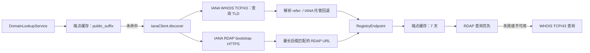

# 基于 IANA WHOIS 的注册局端点发现设计

## 1. 背景与目标

当前 `IanaClient` 通过请求 `https://www.iana.org/domains/root/db/{tld}.html`，再以
BeautifulSoup 定位页面中的 `WHOIS Server:` 标签，取得注册局 WHOIS 主机。该页面是面向
人类阅读的 Root Zone Database 展示层，并非稳定的机器接口；其 HTML、标签、文案或页面
结构变化都会使端点发现失败。

本次重构把 WHOIS 端点发现改为直接查询 IANA 的权威 WHOIS 服务
`whois.iana.org:43`。保留现有 RDAP bootstrap（`https://data.iana.org/rdap/dns.json`）
路径，且不改变上层“RDAP 优先、WHOIS 回退”的查询策略。

目标：

- 删除对 IANA Root Zone Database HTML 的爬取和解析依赖；
- 从 IANA WHOIS 的 `refer:` 字段安全、可观测地提取下游注册局 WHOIS 主机；
- 将 IANA 根区记录与“实际可查的注册局 WHOIS 端点”清晰地区分；
- 维持现有端点缓存、失败降级、Worker 异步执行和公开 `DomainLookup` API；
- 用离线 fixture 覆盖协议与异常分支，避免测试依赖外网。

非目标：

- 不把 WHOIS 协议替换为 RDAP，也不调整 RDAP 优先顺序；
- 不在本阶段扩充各 ccTLD 的 `WhoisProfile`；
- 不递归跟随注册局 WHOIS 返回的二次 referral；域名数据查询仍只请求发现到的注册局一次。

## 2. 依据与协议约定

RFC 3912 定义 WHOIS 为 TCP 的一次请求/响应事务：服务端监听 43 端口，客户端发送以
ASCII `CRLF` 结尾的文本请求；响应结束以服务端关闭连接为准，不能把响应中的换行当作结束
标志。[RFC 3912](https://datatracker.ietf.org/doc/html/rfc3912)

IANA 明确说明其 WHOIS 服务位于 `whois.iana.org:43`，支持域名查询；返回内容为 UTF-8
编码、冒号分隔的 `key: value`，以 `%` 开头的行为注释。对于已有更权威记录的对象，IANA
会返回 `refer:` 字段，值为更权威 WHOIS 服务器。例如查询二级域名时，IANA 可以根据其根区
记录给出对应 TLD 注册局的 WHOIS referral。[IANA WHOIS 使用说明](https://www.iana.org/help/whois)

因此端点发现应使用标准化后的 **可注册域名**，即发送：

```text
example.com\r\n
```

IANA 的说明明确以 `icann.org` 这类二级域名查询为例：IANA 返回自己在根区中权威的 `.org`
记录，并给出更权威注册局的 `refer:`。因此完整可注册域名是获得注册局 referral 的正确查询
键；不能假设只查询 `com` 时也会出现 `refer:`。

### 2.1 IANA 响应的最小解析契约

实现只依赖以下稳定、公开的 IANA 语义：

| 组件 | 规则 |
| --- | --- |
| 字符集 | 响应字节必须按 UTF-8 解码；无效 UTF-8 是端点发现失败。 |
| 注释 | 忽略首字符为 `%` 的行与空行。 |
| 字段 | 以第一个 `:` 分割，字段名以 ASCII 方式大小写无关匹配。 |
| `domain` | 若存在，必须等于请求域名的 TLD（忽略前导 `.`、尾随 `.`、大小写）；不匹配时拒绝该响应。 |
| `refer` | 可选。仅接受单个非空值，作为下游 WHOIS 主机。 |
| 无 `refer` | 表示 IANA 未提供可用下游 WHOIS 主机；这不是 IANA 协议错误。 |

IANA 根区记录中的 `whois:` 是该 TLD 自身的 WHOIS 服务字段，不能与 `refer:` 混用：
对 `.int`、`.arpa` 等由 IANA 服务的命名空间，它可能就是 `whois.iana.org`。本设计以
`refer:` 作为常规注册局发现结果；只有在专门定义的 IANA 托管命名空间规则允许时，才可将
`whois:` 作为回退端点，详见第 4 节。

## 3. 目标调用链



`RegistryEndpoint.key` 仍为 `domain.public_suffix`，因为缓存的消费方按 Public Suffix
读取；但 IANA WHOIS 的网络查询键为 `domain.registrable_domain`。这与 IANA referral 的语义
一致；同时现有缓存仍会让同一 Public Suffix 的后续请求避免重复发现。

## 4. 实现设计

### 4.1 新增专用 IANA WHOIS transport/client

新增内部组件（建议文件：`_internal/clients/iana_whois.py`）：

```python
class IanaWhoisClient:
    HOST = "whois.iana.org"
    PORT = 43

    async def lookup_domain(self, domain: str) -> IanaWhoisRecord:
        """发送 f'{domain}\\r\\n'，读取至 EOF，并解析 IANA key/value 响应。"""
```

实现使用 `asyncio.open_connection()`，而非在事件循环中直接执行同步 socket：

1. 对已经被 `DomainNormalizer` 标准化的 ASCII/Punycode 可注册域名做输入安全校验；
2. 打开至固定主机和固定端口 43 的 TCP 连接，并应用连接/读超时；
3. 发送 `tld.encode("ascii") + b"\r\n"`，执行 `drain()`；
4. 持续读取至 EOF，设置响应大小上限（建议沿用 WHOIS 客户端的 2 MiB）；
5. 关闭 writer 并等待 `wait_closed()`；
6. 严格 UTF-8 解码，解析为不可变 `IanaWhoisRecord`。

这样复用 RFC 3912 的真实边界条件：EOF 才代表完整响应。通用 `WhoisClient` 暂不抽象为共享
transport，以控制本次改动范围；两个实现的 socket 限制和超时常量应在后续清理中统一。

### 4.2 IANA 记录模型与解析

建议使用内部 dataclass：

```python
@dataclass(frozen=True, slots=True)
class IanaWhoisRecord:
    domain: str | None
    referral_server: str | None
    whois_server: str | None
```

解析器保留重复字段的完整性检查：`domain`、`refer`、`whois` 任一字段出现互相冲突的多个
非空值，抛 `EndpointDiscoveryError`。未知字段不影响解析。解析器不负责判断 `refer` 指向的
主机是否可连接。

`refer` / `whois` 值需满足以下要求后才能写入 `RegistryEndpoint.whois_server`：

- 只接受裸 DNS 主机名；不接受 URL、`host:port`、空白、控制字符、IP 字面量或用户信息；
- 进行 IDNA 规范化为 ASCII，小写化并去除末尾 `.`；
- 验证总长度和单标签长度符合 DNS 主机名限制；
- 拒绝 `whois.iana.org` 以外的 referral 环（本阶段不会继续追踪）；
- 绝不从响应中采纳端口，WHOIS 查询端口始终为 43。

此校验既避免损坏缓存，也避免不受信任的远端响应将后续查询导向任意 socket 地址。

### 4.3 在 `IanaClient` 中编排

`IanaClient.discover(domain)` 继续用 `asyncio.gather(..., return_exceptions=True)` 并行执行：

- `_discover_whois(domain)` 改为调用 `IanaWhoisClient.lookup_domain()`；优先返回
  `record.referral_server`；
- 如没有 `refer:`，仅当 `domain.tld` 属于显式白名单 `{"int", "arpa"}` 且
  `record.whois_server == "whois.iana.org"` 时，返回该 `whois:` 值；
- 所有其他无 referral 情况返回 `None`，让 RDAP 仍可独立成功；
- `_discover_rdap()` 保持不变。

白名单是刻意保守的：不能仅因为 IANA 返回 `whois:` 就假定其可完成注册局数据查询。新增 IANA
托管命名空间前，需要 fixture 和实际协议证据。

### 4.4 错误与缓存语义

| 情况 | `discover()` 行为 | 缓存 |
| --- | --- | --- |
| IANA WHOIS 有合法 `refer:` | 填充 `whois_server` | 缓存成功端点 7 天 |
| IANA WHOIS 无 `refer:`，RDAP 成功 | 仅返回 RDAP URL | 缓存成功端点 7 天 |
| IANA WHOIS 失败，RDAP 成功 | 同上 | 缓存成功端点 7 天 |
| IANA WHOIS 成功但无端点，RDAP 也失败 | 抛 `EndpointDiscoveryError` | 不缓存失败 |
| IANA 响应格式/编码/字段冲突错误，RDAP 成功 | 同上，仅 RDAP | 缓存成功端点 7 天 |

现有的 `DomainLookupService` 协议顺序保持 `("rdap", "whois")`。当仅发现 RDAP 时，WHOIS
客户端会抛 `ProtocolUnavailableError`，这属于已有的回退失败语义；当仅发现 WHOIS 时，RDAP
不可用后会继续 WHOIS。

## 5. 迁移与实施路线

### 阶段 0：基线与契约（本设计文档）

- 固化 IANA/RFC 3912 的协议约定及“查询 TLD、读取 EOF、解析 `refer:`”的行为；
- 收集 `.com`（有 referral）、`.int` / `.arpa`（IANA 托管）和未分配/历史 TLD 的脱敏原始
  报文 fixture；
- 为现有 `IanaClient` 行为建立测试基线，确认 RDAP 分支没有依赖 HTML。

### 阶段 1：纯解析与 transport

- 增加 `IanaWhoisRecord`、行解析器和 referral 主机验证器；
- 增加异步 TCP 客户端及超时、响应上限、EOF、关闭连接的单元测试；
- 不修改 `IanaClient` 的生产调用；所有测试使用 fake reader/writer 或本地测试服务器。

验收：错误输入不会产生主机名；每个合法 fixture 稳定产出预期记录。

### 阶段 2：替换端点发现实现

- 在 `IanaClient` 注入 `IanaWhoisClient`，删除 BeautifulSoup 及
  `ROOT_DATABASE_URL`、`_discover_whois()` 的 HTML 解析逻辑；
- 保持 `RegistryEndpoint` schema 和 endpoint cache 不变；
- 移除不再使用的 `bs4` 运行时依赖（确认项目没有其他使用者后）。

验收：`.com` 发现 `whois.verisign-grs.com`，RDAP URL 仍由 bootstrap 得到；WHOIS 分支
故障不阻断可用 RDAP。

### 阶段 3：集成与回归

- 为 `DomainLookupService` 写端到端 fake-client 测试，覆盖 RDAP 优先、WHOIS 回退和 endpoint
  cache hit；
- 为 Worker 刷新任务增加一次成功快照断言，确保 `source="whois"` / `source="rdap"` 的
  持久化不变；
- 执行完整测试套件和类型/静态检查（按仓库既有命令）。

### 阶段 4：上线观测与清理

- 为端点发现加入结构化日志或指标：IANA WHOIS 成功/解析失败、`refer` 缺失、RDAP-only、
  缓存命中；日志不可记录完整 WHOIS 原报文；
- 灰度环境用少量不同 gTLD/ccTLD 检查缓存刷新与失败分类；
- 观察一个端点缓存 TTL 周期后，删除遗留 HTML fixture、文档和依赖。

## 6. 测试矩阵

| 层级 | 场景 | 预期 |
| --- | --- | --- |
| IANA parser | `%` 注释、大小写混合字段、额外字段 | 正确忽略/提取 |
| IANA parser | UTF-8 非法、缺失冒号的有效无关行、冲突 `refer` | 分别报编码错误、忽略或报格式错误 |
| 主机验证 | `whois.example.test`、尾点、Punycode | 输出合法 canonical hostname |
| 主机验证 | URL、`host:43`、IP、控制字符 | 拒绝 |
| TCP transport | 分块响应、响应中多行、EOF | 合并完整正文，EOF 成功 |
| TCP transport | 连接/读取超时、超过上限 | 明确失败且连接关闭 |
| IanaClient | referral + RDAP | 同时填充两类端点 |
| IanaClient | 无 referral + RDAP | 仅 RDAP，成功 |
| IanaClient | IANA-only 白名单 TLD | 允许 `whois.iana.org` |
| 业务集成 | RDAP 失败、WHOIS 可用 | WHOIS 回退成功 |
| 业务集成 | 缓存命中 | 不建立网络连接 |

## 7. 待确认的实现决策

1. **IANA 托管命名空间范围**：首版建议只白名单 `.int`、`.arpa`。若业务需要 root TLD
   级数据，也可单独提供“根区查询”能力，不能把它误当作普通注册域名的 WHOIS 查询。
2. **缓存刷新策略**：沿用 7 天成功缓存；IANA 端点变更通常较少。若需要更快收敛，应提供
   管理端的 `refresh_endpoint=True`，而不是缩短所有查询的 TTL。
3. **WHOIS Profile 覆盖面**：端点发现成功不等于响应可解析。当前默认仅有 `.cn` Profile，
   因此其他 TLD 的 RDAP 失败仍可能得到 `unsupported`。Profile 扩展应作为独立工作项，按
   TLD fixture 逐个加入。
4. **网络策略**：TCP/43 在部分部署网络会被阻断；部署文档需要明确允许到
   `whois.iana.org:43` 和发现后注册局主机的出站 TCP/43，以及 IANA RDAP bootstrap 的 HTTPS。

## 8. 风险与缓解

- **IANA 缺少 `refer:`**：不能猜测注册局主机；返回 `None` 并交由 RDAP，必要时在白名单中
  显式支持 IANA 托管空间。
- **WHOIS 无统一字段格式**：本重构只解析 IANA 的已文档化 key/value 格式；注册局响应继续
  通过 `WhoisProfile` 解析。
- **SSRF/恶意重定向**：只接受经过严格验证的裸主机名、固定端口 43，并限制为单跳。
- **IANA 或注册局临时故障**：延用现有协议级回退、任务重试与不缓存失败的策略。
- **HTML 依赖残留**：阶段 2 删除 HTML URL、BeautifulSoup 调用和对应依赖，测试中断言不会发起
  `www.iana.org/domains/root/db/*` 请求。
