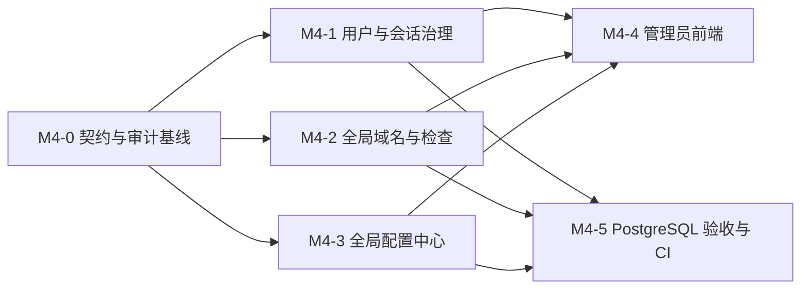

# M4 管理员与全局管理设计

## 1. 范围、目标和非目标

M4 收尾目标是让 `admin` 能安全地管理用户、跨用户域名、检查记录和允许热更新的全局业务策略，且每个
写操作可追溯、可并发验证、不会泄漏凭据或原始查询报文。

不属于 M4：密码重置、OAuth/TOTP、通用域名所有权转移、Secret 管理、数据库/网络/TLS 配置迁移，以及
生产发布拓扑。这些分别属于 M5、M6 或部署平台。

现有实现已经提供管理员授权、用户基础管理、封禁/解封、全局域名基础查询/编辑/删除/刷新，以及
`successful_refresh_ttl_seconds` 的持久化样例。本计划只补齐缺口，不重构已验证的 M1–M3 链路。

## 2. 设计原则

- 所有管理员写操作必须先验证 `require_admin`，并在同一短事务写入业务变更与 `SecurityAuditEvent`；
- 管理员可跨用户读取业务元数据，但响应不得包含密码哈希、会话/Token、通知凭据、OAuth/TOTP Secret 或原始 WHOIS/RDAP 报文；
- 用户资源仍按 owner 隔离；管理员访问不改变普通用户接口的 `404` 隐藏语义；
- 更新使用版本或 `If-Match`，批量操作需明确幂等键/确认语义；
- 外部查询仍由异步刷新任务执行，管理员操作只入队并返回任务，不在管理员 HTTP 请求中查询 RDAP/WHOIS；
- PostgreSQL 是管理员列表、统计、并发和锁语义的验收数据库，SQLite 只承担快速回归。

## 3. 工作包与依赖

| 工作包 | 前置 | 交付结果 | 独立验收 |
| --- | --- | --- | --- |
| M4-0 契约与审计基线 | M1–M3 | 实现清单、缺口契约、统一审计帮助器 | 每个管理员写操作都有 actor、target、request ID、脱敏摘要 |
| M4-1 用户与会话治理 | M4-0 | 用户详情/编辑、封禁/解封、显式撤销会话 | 并发封禁/解封和自操作规则确定 |
| M4-2 全局域名与检查 | M4-0 | 全局域名筛选/统计、检查历史/失败统计 | 分页、排序、索引和数据脱敏正确 |
| M4-3 全局配置中心 | M4-0 | 注册表、版本化配置、审计、热更新边界 | 多进程在声明时限内使用新版本 |
| M4-4 管理员前端 | M4-1 至 M4-3 | 受角色保护的管理界面和确认流程 | UI 不显示敏感字段，错误/冲突可恢复 |
| M4-5 验收与门禁 | M4-1 至 M4-3 | PostgreSQL 测试、契约测试和扩大后的 CI 检查 | 所有 M4 完成条件可重复验证 |

## 4. M4-0：契约与审计基线

### 任务

1. 对照运行时路由与 `docs/api/openapi.yaml`，将“已实现”“本 M4 待实现”“M5 预留”分开维护；未实现端点不得被前端调用。
2. 形成管理员操作矩阵，逐项列出读/写权限、确认头、并发条件、审计事件和敏感字段排除规则。
3. 提取统一审计写入服务或明确的 UoW 辅助方法，避免每个路由自行遗漏 request ID、目标或变更摘要。
4. 补齐现有刷新策略写操作的审计；审计只保存键名和脱敏后的 old/new 摘要。

### 操作矩阵

| 操作 | 角色 | 并发/确认 | 审计事件 | 备注 |
| --- | --- | --- | --- | --- |
| 编辑用户资料 | admin | 用户更新时间或版本 | `admin.user_updated` | 不可编辑角色、密码哈希或封禁内部字段 |
| 封禁/解封 | admin | 状态转换幂等 | `admin.user_banned` / `admin.user_unbanned` | 禁止封禁自己；封禁撤销目标会话 |
| 撤销会话 | admin | 会话状态条件更新 | `admin.session_revoked` | 目标会话不存在或已撤销须有确定结果 |
| 编辑/删除域名 | admin | `If-Match` / `X-Confirm-Action` | `admin.domain_updated` / `admin.domain_deleted` | 仅改本地字段，删除为软删除 |
| 强制刷新 | admin | `Idempotency-Key` | `admin.domain_refresh_requested` | 仅入队，不记录原始报文 |
| 更新全局策略 | admin | 配置版本 `If-Match` | `admin.global_setting_updated` | 记录生效边界和脱敏差异 |

### 验收

- 非管理员均返回 `403`；
- 每个写端点的成功、冲突和拒绝路径均有契约测试；
- 审计记录在同一事务内提交，事务失败不能留下“成功操作”的孤立审计。

## 5. M4-1：用户与会话治理

### 设计

用户详情页以只读安全信息、基本资料、域名数量和会话概览组成。管理员只能编辑允许的资料字段；角色
提权、密码重置和身份提供方管理不在本工作包内。

封禁是状态变更：写入封禁时间/原因/操作者，撤销全部未撤销的 Session 与 Refresh Token，并追加审计。
解封只恢复登录资格，**不恢复**旧 Session。这样封禁前发出的凭据不会在解封后重新有效。

新增显式会话撤销能力时，先固定产品规则：管理员不得撤销自己当前会话；是否允许撤销自己的其他会话
由当前用户 API 处理，管理员 API 不重复提供。会话列表仅返回 ID、创建/最后使用时间、撤销状态和安全的
客户端摘要，不返回 Token 或完整 IP/User-Agent。

### 任务

1. 增加用户状态筛选、分页稳定排序和详情所需的聚合数据。
2. 为会话列表和单会话撤销设计管理员端点；若需要“全部撤销”，与封禁逻辑复用同一领域服务。
3. 对封禁、解封、会话撤销执行条件更新，消除并发下的重复审计或状态反转。
4. 实现用户详情/编辑抽屉（或页面）、封禁原因输入、解封确认和会话撤销确认。

### 验收场景

- 两个管理员同时封禁同一用户：只有一个产生状态变更审计；
- 封禁后已有 Access 与 Refresh 凭据均被拒绝；解封后仍需重新登录；
- 已撤销会话再次撤销遵循明确的幂等响应；
- 管理员不能封禁自己或撤销自己的当前会话。

## 6. M4-2：全局域名、检查与统计

### 读模型

全局域名列表按创建时间、域名名、最后检查时间和到期时间排序；筛选包括 owner、名称、监控状态、软删除
状态和最近结果。响应包含所有者引用、公开域名身份、本地监控字段和脱敏快照摘要，不返回原始查询报文。

全局检查历史按域名、用户、结果、错误码和时间范围筛选。失败统计使用稳定错误码和时间窗口聚合；统计
端点只返回计数、分组键和窗口，不把失败异常全文当成分析字段。

### 任务

1. 在 OpenAPI 先定义全局检查历史和统计响应、过滤/排序白名单与分页语义。
2. 实现 `DomainCheck` 的管理员查询和聚合服务；避免 N+1，限制允许排序的列。
3. 根据 PostgreSQL `EXPLAIN` 为常用过滤新增复合索引，并验证不会恶化用户侧查询。
4. 补充管理员域名详情的检查历史入口、删除确认、强制刷新及任务状态展示。

### 验收场景

- 管理员可查任意用户的域名和检查记录，普通用户仍无法越权；
- 相同筛选条件下分页无重复/漏项；
- 软删除域名默认排除，显式 `include`/`only` 的语义一致；
- 失败统计与原始检查记录计数一致，且错误详情不泄漏敏感信息。

## 7. M4-3：全局配置中心

详细分类、数据流程和分批迁移顺序见[全局运行配置管理](global-configuration-management.md)。M4 内的实现顺序为：

1. 键注册表和配置 DTO：类型、范围、默认值、热更新标记、目标进程和交叉约束。
2. 为 `global_setting` 添加版本、更新操作者等必要字段，并迁移现有新鲜度策略；迁移必须兼容既有数据库。
3. 配置读服务：数据库覆盖值优先，回退应用 Settings 默认值；按进程工作循环读取或使用受控短 TTL 缓存。
4. 管理员读写 API：只允许注册键，使用 `If-Match`，原子写入值和审计。
5. 分批接入检查周期、任务/通知重试、租约、调度批量/轮询和注册开关；每批增加跨进程生效测试。
6. 管理员配置页：展示值来源、版本、最大生效延迟、最近审计和“需重启”标记。

禁止迁移数据库连接、监听/端口、JWT/Refresh Secret、SMTP 密码、TLS、CORS、迁移开关和首次管理员引导凭据。

## 8. M4-4：前端集成

前端以当前角色为第一层导航保护，但所有授权仍以后端为准。新增/完善的页面按以下顺序交付：

1. 用户列表：状态筛选、稳定分页、用户详情入口。
2. 用户详情：资料编辑、封禁/解封、会话概览与撤销确认。
3. 全局域名：服务器端筛选/分页/排序，详情抽屉，删除与强制刷新确认。
4. 检查与统计：历史筛选、失败趋势/分组，链接回域名和所有者。
5. 全局配置：键分组、帮助文本、版本冲突提示、值来源和审计历史。

高风险按钮必须显示操作对象和影响范围；删除使用明确确认；强制刷新使用唯一幂等键；`409`/`428` 让用户刷新
数据后重试，而不是静默覆盖。前端不得缓存或输出管理 Token、原始错误报文或 Secret。

## 9. M4-5：测试、迁移与发布门槛

### 自动化测试

- 单元：权限判断、配置注册表、交叉约束、审计摘要、统计分组；
- API 契约：403、422、409、428、确认头、敏感字段排除和分页/排序；
- PostgreSQL：并发封禁/解封、会话撤销、配置版本冲突、管理员检查统计、索引查询计划；
- 端到端：管理员前端主要路径、权限隐藏仅作体验测试，后端拒绝作为安全断言；
- 回归：M1–M3 用户域名、任务、Scheduler、Notifier 行为不因管理员功能改变。

### 合并与发布门槛

1. `docs/api/openapi.yaml`、本设计、路线图和实现同步；
2. 迁移可从空库和上一个发布 revision 升级，且有回退策略说明；
3. 全仓格式/lint 检查纳入 CI，不能继续只覆盖早期域名 CRUD 文件；
4. 通过专用、可清空 PostgreSQL 实例运行 M4 标记测试；
5. 管理员前端生产构建通过，且没有把 Secret 打入静态资源或日志。

## 10. 推荐提交序列

1. `docs(m4): reconcile contract and define audit matrix`
2. `feat(admin): complete audit coverage and user session governance`
3. `feat(admin): add global domain checks and failure analytics`
4. `feat(settings): introduce versioned global runtime configuration`
5. `feat(frontend): complete administrator management workflows`
6. `test(m4): add PostgreSQL concurrency and contract acceptance`
7. `ci: enforce full-repository quality gates`

每个提交必须保持可运行，并包含对应迁移、测试和文档；不要把 M5 的密码重置或 Secret 管理混入 M4。
